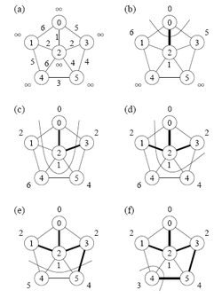

## O que é

- É um subconjunto do grafo
- Deverá conectar todos os vértices do grafo
- Deverá conter o caminho que possui o menor peso.

## Para ser considerada AGM

<p align="center"> 

</p>

- Grafo deve ser conexo
- Não deve possuir nenhum ciclo
- Deve ser em grafos não-direcionados
- Deve ser em grafos ponderados (as arestas possuem pesos)

## Algoritmos Gulosos

- Não oferece garantia
- Mas é possível provar uma MST

```{c}
void GenericoMST() { 
    S = {};
    while(S não constitui uma árvore geradora mínima) { 
        (u, v) = seleciona(A);
        if (aresta (u, v) é segura para) 
            S = S + {(u, v)};
    }
    return S;
}
```

<div class="notes">
Antes de cada iteração, S é um subconjunto de uma MST.
A cada aresta que verificamos, adicionamos a S a aresta (u,v) que não viola a variante.
Essa aresta é chamada de *aresta segura*.

Dentro do *while*, S tem que fazer parte do subconjunto prórpio da MST T, e quando existir uma aresta (u,v) que pertence a T e que não pertence a S e é considerado uma *aresta segura*, ele é adicionado ao conjunto de S.
</div>

## Corte | Aresta segura

<p align="center"> 

</p>

<div class="notes">
- Um corte (V′, V−V′) de um grafo não direcionado G = (V, A) é uma partição de V.
- Uma aresta (u, v) ∈ A cruza o corte (V′, V−V′) se um de seus vértices  perrtence a V′ e o outro vértice pertence a V−V′.
- Um corte respeita um conjunto S de arestas se não existirem arestas em S que o cruzem.
- Uma aresta cruzando o corte que tenha custo mínimo sobre todas as
arestas cruzando o corte é uma aresta leve.
</div>

## Algoritmo de Prim

<p align="center"> 

</p>

---

